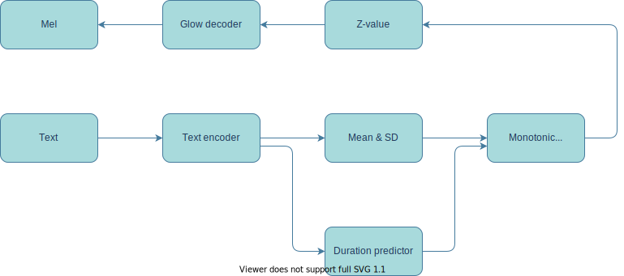
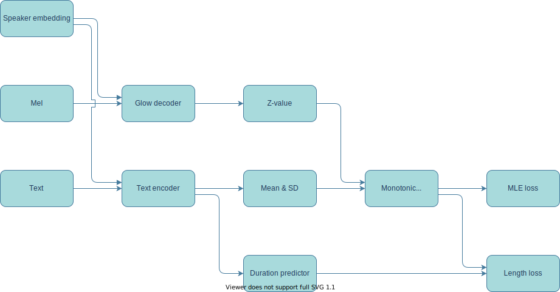
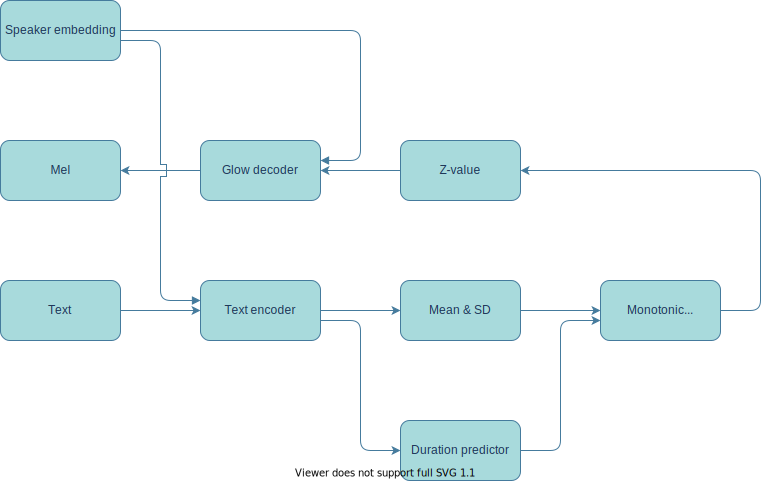
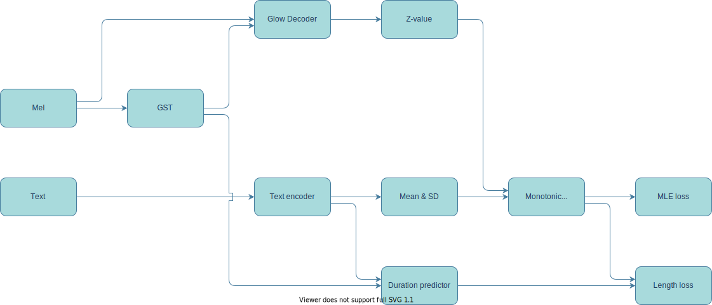
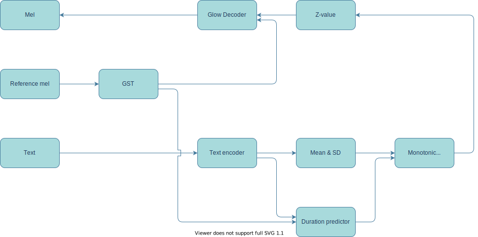
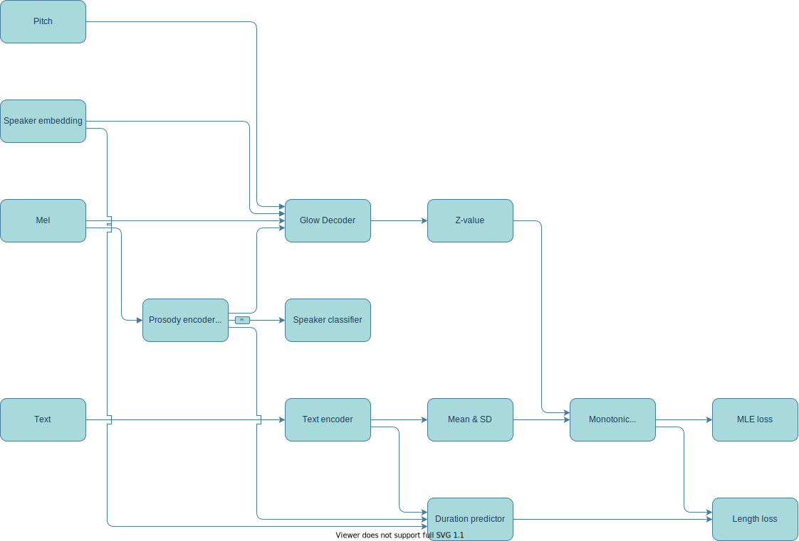
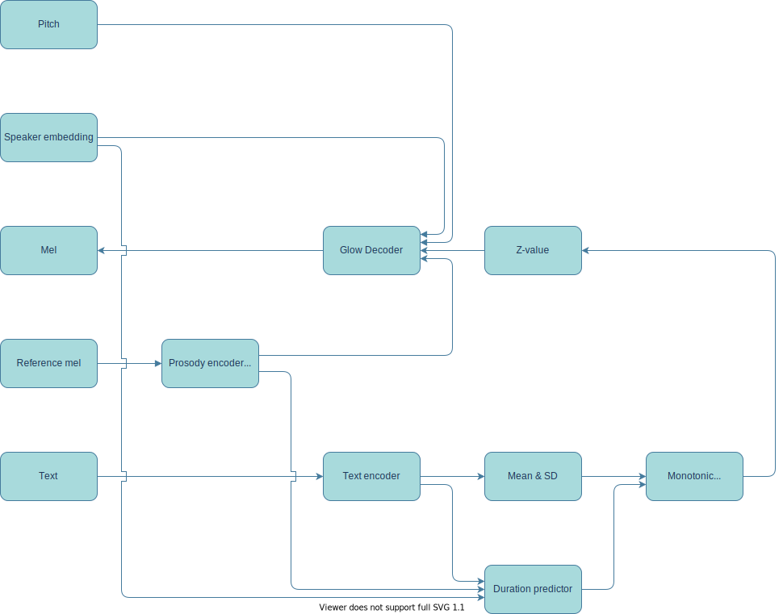

# Multispeaker GlowTTS

* This code is a replication of [official Glow TTS code](https://github.com/jaywalnut310/glow-tts). If you want to use Glow TTS model, I recommend that you refer to the official code.
* The following is the paper I referred:
    * Glow TTS
        * [Kim, J., Kim, S., Kong, J., & Yoon, S. (2020). Glow-TTS: A Generative Flow for Text-to-Speech via Monotonic Alignment Search. arXiv preprint arXiv:2005.11129.](https://arxiv.org/abs/2005.11129)
        * [Shaw, P., Uszkoreit, J., & Vaswani, A. (2018). Self-attention with relative position representations. arXiv preprint arXiv:1803.02155.](https://arxiv.org/abs/1803.02155)

    * GE2E speaker embedding
        * [Wan, L., Wang, Q., Papir, A., & Moreno, I. L. (2017). Generalized end-to-end loss for speaker verification. arXiv preprint arXiv:1710.10467.](https://arxiv.org/pdf/1710.10467)
        * [Jia, Y., Zhang, Y., Weiss, R. J., Wang, Q., Shen, J., Ren, F., ... & Wu, Y. (2018). Transfer Learning from Speaker Verification to Multispeaker Text-To-Speech Synthesis. arXiv preprint arXiv:1806.04558.](http://papers.nips.cc/paper/7700-transfer-learning-from-speaker-verification-to-multispeaker-text-to-speech-synthesis.pdf)
        * [Qian, K., Zhang, Y., Chang, S., Yang, X., & Hasegawa-Johnson, M. (2019). Zero-shot voice style transfer with only autoencoder loss. arXiv preprint arXiv:1905.05879.](https://arxiv.org/pdf/1905.05879)

    * Prosody encoder (Global style token layer)
        * [Wang, Y., Stanton, D., Zhang, Y., Skerry-Ryan, R. J., Battenberg, E., Shor, J., ... & Saurous, R. A. (2018). Style tokens: Unsupervised style modeling, control and transfer in end-to-end speech synthesis. arXiv preprint arXiv:1803.09017.](https://arxiv.org/abs/1803.09017)

    * Gradient reversal layer
        * [Zhang, Y., Weiss, R. J., Zen, H., Wu, Y., Chen, Z., Skerry-Ryan, R. J., ... & Ramabhadran, B. (2019). Learning to speak fluently in a foreign language: Multilingual speech synthesis and cross-language voice cloning. arXiv preprint arXiv:1907.04448.](https://arxiv.org/abs/1907.04448)
        * [Jung, S., & Kim, H. (2020). Pitchtron: Towards audiobook generation from ordinary people's voices. arXiv preprint arXiv:2005.10456.](https://arxiv.org/abs/2005.10456)

# Requirements

* torch >= 1.5.1
* tensorboardX >= 2.0
* librosa >= 0.7.2
* matplotlib >= 3.1.3

* Optional for loss flow
    * tensorboard >= 2.2.2

# Structure

## Vanilla mode (Single speaker GlowTTS)

<details>
<summary></summary>

### Training


### Inference

</details>


## Speaker embedding mode

<details>
<summary></summary>

### Training


### Inference

</details>

## Prosody encoding mode (GST GlowTTS)

<details>
<summary></summary>

### Training


### Inference

</details>

## Gradient reversal mode (Voice cloning GlowTTS - Failed)

<details>
<summary></summary>

### Training


### Inference

</details>

# Used dataset

* Currently uploaded code is compatible with the following datasets.
* The O marks to the left of the dataset name are the dataset actually used in the uploaded result.

| Single | | Multi  | | Dataset   | Dataset address                                 |
|--------|-|--------|-|-----------|-------------------------------------------------|
| O      | | O      | | LJSpeech  | https://keithito.com/LJ-Speech-Dataset/         |
| X      | | X      | | BC2013    | http://www.cstr.ed.ac.uk/projects/blizzard/     |
| X      | | O      | | CMU Arctic| http://www.festvox.org/cmu_arctic/index.html    |
| X      | | O      | | VCTK      | https://datashare.is.ed.ac.uk/handle/10283/2651 |
| X      | | X      | | LibriTTS  | https://openslr.org/60/                         |

# Hyper parameters
Before proceeding, please set the pattern, inference, and checkpoint paths in 'Hyper_Parameters.yaml' according to your environment.

* Sound
    * Setting basic sound parameters.
    * Some paramters like pitch are not used in current code. These are for future works.

* Use_Cython_Alignment
    * Setting which implementation of Monotonic alignment search to use
    * If `true`, the cython implementation of official code will be used.
    * If `false`, the python implementation will be used.
    * I recommend to use cython implementation because of speed.
        * But, to use cython implementation, you must complie this before running.
        * Please refer following: https://github.com/jaywalnut310/glow-tts#2-pre-requisites

* Encoder
    * Setting the encoder parameters

* Decoder
    * Setting the glow decoder parameters.

* WaveNet
    * Setting the parameters of Vocoder.
    * This implementation uses a pre-trained Parallel WaveGAN model.
        * https://github.com/CODEJIN/PWGAN_Torch
    * If checkpoint path is `null`, model does not exports wav files.
    * If checkpoint path is not `null`, all parameters must be matched to pre-trained Parallel WaveGAN model.

* Speaker_Embedding
    * Setting the speaker embedding generating method
    * In `Type`, you can select `null`, `'LUT'`, `'GE2E'`
        * `null`: No speaker embedding. Single speaker version
        * `LUT`: Model will generate a lookup table about the speakers.
        * `GE2E`: Model will use d-vectors which is generated by a pretrained GE2E model.
            * Pretrained GE2E model is from [Speaker_Embedding_Torch](https://github.com/CODEJIN/Speaker_Embedding_Torch)

* Token path
    * Setting the token-to-index dict.
    * Pattern generator makes this file.

* Train
    * Setting the parameters of training.

* Inference_Batch_Size
    * Setting the batch size when inference.
    * If `null`, it will be same to `Train/Batch_Size`

* Inference_Path
    * Setting the inference path

* Checkpoint_Path
    * Setting the checkpoint path

* Log_Path
    * Setting the tensorboard log path

* Use_Mixed_Precision
    * Setting mixed precision.
    * To use, `Nvidia apex` must be installed in the environment.
    * In several preprocessing hyper parameters, loss overflow problem occurs.

* Device
    * Setting which GPU device is used in multi-GPU enviornment.
    * Or, if using only CPU, please set '-1'.

# Generate pattern

## Command
```
python Pattern_Generate.py [parameters]
```

## Parameters

At least, one or more of datasets must be used.

* -lj <path>
    * Set the path of LJSpeech. LJSpeech's patterns are generated.
* -bc2013 <path>
    * Set the path of Blizzard Challenge 2013. Blizzard Challenge 2013's patterns are generated.    
* -cmua <path>
    * Set the path of CMU arctic. CMU arctic's patterns are generated.
* -vctk <path>
    * Set the path of VCTK. VCTK's patterns are generated.
* -libri <path>
    * Set the path of LibriTTS. LibriTTS's patterns are generated.
* -vc1 <path>
    * Set the path of VoxCeleb1. Glow-TTS does not supports this because VoxCeleb datasets do not have text data.
* -vc2 <path>
    * Set the path of VoxCeleb2. Glow-TTS does not supports this because VoxCeleb datasets do not have text data.
* -vc1t <path>
    * Set the path of VoxCeleb1 testset. Glow-TTS does not supports this because VoxCeleb datasets do not have text data.
* -text
    * Set whether the text information save or not.
    * This is for other model. To use in Glow TTS, this option must be set.
* -evalr
    * Set the evaluation pattern ratio.
    * Default is `0.001`.
* -evalm
    * Set the evaluation pattern minimum of each speaker.
    * Default is `1`.
* -mw
    * The number of threads used to create the pattern
    * Default is `10`.

# Run

## Command
```
python Train.py -s <int>
```

* `-s <int>`
    * The resume step parameter.
    * Default is 0.
    * When this parameter is 0, model try to find the latest checkpoint in checkpoint path.

# Result

[Please see at the demo site](https://codejin.github.io/Glow_TTS_Demo/index.html)

# Trained checkpoint

| Mode      | Dataset            | Trained steps | Link                                                                                               |
|-----------|--------------------|---------------|----------------------------------------------------------------------------------------------------|
| Vanilla   | LJ                 | 100000        | [Link](https://drive.google.com/file/d/1uBpwMWE5PYA04-voepPEJ7utDXfESOaU/view?usp=sharing)         |
| SE & LUT  | LJ + CUMA          | 100000        | [Link](https://drive.google.com/file/d/1HS_UEMSD4mu5djtatzYcl1rWbCrbE6Yq/view?usp=sharing)         |
| SE & LUT  | LJ + VCTK          | 100000        | [Link](https://drive.google.com/file/d/114z-cSEJHs8DdnIKnEE8pthIME6FprSM/view?usp=sharing)         |
| PE        | LJ + CUMA          | 100000        | [Link](https://drive.google.com/file/d/1Mbz20T1yWuhQcT1RIH5u0j0aM0nqHO19/view?usp=sharing)         |
| PE        | LJ + VCTK          | 400000        | [Link](https://drive.google.com/file/d/1pt7xJb5jR_rtVI4amdLz3dNQGe3PlaLF/view?usp=sharing)         |
| GR & LUT  | LJ + VCTK          | 400000        | [Link(Failed)](https://drive.google.com/file/d/1vRU_M-bbzFmBOt8_pDTcrwHhPsaB08Wa/view?usp=sharing) |


# Future works

* Training with GE2E speaker embedding
* Gradient reversal model structure improvement
* Training additional steps

